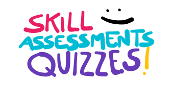
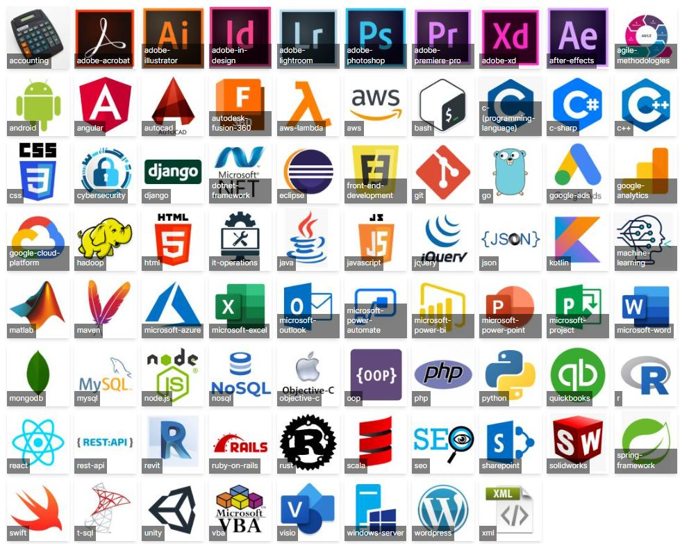

<!-- ALL-CONTRIBUTORS-BADGE:START - Do not remove or modify this section -->
[](#contributors-)
<!-- ALL-CONTRIBUTORS-BADGE:END --> 


#### Contents
 - [:grey_question: How It Works](#how-it-works) 
 - [:framed_picture: Quizz Images Extraction](#imgs-extract) 
 - [:hammer: Start Dev](#dev-start) 
 - [:books: Index Page](#home-dev) 
 - [:performing_arts: Front page Icons](#covers) 
 - [:scroll: The Quiz Page](#quiz) 
 - [:eyeglasses: Quiz progress & Tracking](#tracking) 
 - [:globe_with_meridians: **Contribute with** Translations / Language](#translations)
 - [:computer: **Contribute with** Coding / Bug Fixing](#contribute)
 - [:robot: Automated Testing / Validation](#testing)
 - [:rocket: Deployment](#deploy) 


## [→→→ **:open_book: OPEN QUIZZES :open_book:** ← ← ← ](https://bandinopla.github.io/skill-assessments-quizzes/)



UI for the quizzes found at [Ebazhanov/linkedin-skill-assessments-quizzes](https://github.com/Ebazhanov/linkedin-skill-assessments-quizzes/)
This project feeds from the data of that repo and creates a, hopefully, user friendly interface to easily navigate the quizzes and see the progress when doing them.

---
# :grey_question: How it works
This is a [NextJS](https://nextjs.org/) web app. And it has [Ebazhanov/linkedin-skill-assessments-quizzes](https://github.com/Ebazhanov/linkedin-skill-assessments-quizzes/) as a submodule living in the `data` folder. 

This app extracts the quizzes from that repo and builds a user interface to allow you to easily navigate and test your knowledge on diferent subjects emulating a job interview test scenario. You will be able to see your score, how many you got right and how many you didn't. You can reset and start over at any time.


## <a id="imgs-extract"></a>:framed_picture: Getting the Images used in the quizzes

When you start developing, make sure you have the latest copy of the data folder (`git pull --recurse-submodules`) and then run:

```
yarn run import-images
```

this will extract all images from the `data` folder, used by the quizzes, and copy them into the `public` folder so Next can find them.

---
## <a id="dev-start"></a>:hammer: Start developing
This NextJs App is meant to run on a directory called `skill-assessments-quizzes` so, after running `yarn` and installing all dependencies, run:
```
yarn dev
```
... and head over to http://localhost:3000/skill-assessments-quizzes

---
## <a id="home-dev"></a>:books: Quizzes Index
The main page lives in `pages/index.js`. It calls a method `getAllQuizzes` from `lib/api.js` that scans the `data` folder looking for all markdown files to get a list of all available quizzes (and takes into account the translations too)

#### <a id="covers"></a>:performing_arts: Quiz Image Covers
The image covers of each quiz lives in `public/covers` and the name of each images matches the quiz folder in `pages`. These images were manually created and placed. **If new quizzes were to be added, one should manually create the cover for the new quiz and place it in that folder.**

---
## <a id="quiz"></a>:scroll: Quiz Page
The page that renders the quiz and holds all the data about the progress and navigation is `pages/quiz/[...slug].js`

It creates one static path per quiz/language and recieves the entire markdown as props. The markdown is then processed in the client side.

#### Rendering the quiz
To render the quiz the module [react-markdown](https://www.npmjs.com/package/react-markdown) is used and 3 custom components are set to handle the rendering of:
1. **Quiz Question item**: A question option component that knows about the quiz context and calls the appropiate callbacks when the users pics and option. It also knows the state of the quiz so as to style itself with the correct colors.
2. **Code snipped**: A component to render when a code snipped is used. Internally will use [react-syntax-highlighter](https://www.npmjs.com/package/react-syntax-highlighter) to render a highlighted code block.
3. **Image reference**: when an image is referenced in a quiz, this component will make sure the image is pointed to the correct path in the `public` folder. ( a subfolder created by `yarn run import-images` will exist there called `data` with all the images )

---
## <a id="tracking"></a>:eyeglasses: Quiz progress storage / tracking
The progress of the user is stored in memory. The manager of this is `lib/QuizSolvedState.js`

When the quiz page is rendered, the hook `useQuizSolvedState` recieves the ID of the quiz (the name of the folder in `data`) and the question number it should render to then provide an api to handle the user interaction with the quiz. 

`pages/quiz/[...slug].js` then sets a Context that provides revelvant quiz info to the components of the quiz among some callbacks to handle user interaction.

---
## <a id="translations"></a>:globe_with_meridians: Translations / Language
There are 2 sources of language dictionaries:
1. the web app translation files (for the web app UI)
2. the individual quizzes translation files (for the quiz itself)

#### 1. System/UI language
To translate for this web app, [fork this repo](https://github.com/bandinopla/skill-assessments-quizzes) make the translation and do a pull request.

this web app can be translated by creating a [YAML](https://yaml.org/) file in the `l18n` folder named after the language that it is meant to translate. We use the [iso-language-codes](https://www.npmjs.com/package/iso-language-codes) package. We espect is a **[ISO 639-1](https://en.wikipedia.org/wiki/ISO_639-1)** code for the file name of each language file. Example: `es.yaml` for spanish...

use the `en.yaml` as base: duplicate it, rename it, and do your thing. The system will automatically scan that folder and find it once it builds.

To check if the translations are correct, you can run:

```
yarn test-translations
```

#### 2. Quizzes Translations
to collab with the quizzes repo and transalte a quiz to another language head over to the [linkedin-skill-assessments-quizzes](https://github.com/Ebazhanov/linkedin-skill-assessments-quizzes) fork that repo, make the translation in the respective quiz and solicit a pull request to them.

---
## <a id="contribute"></a>:computer: **Contribute with** Coding / Bug Fixing
To contribute with new mechanic or bug fixing for this web app, [fork this repo](https://github.com/bandinopla/skill-assessments-quizzes) do your thing and pull request.

---
## <a id="testing"></a>:robot: Testing / Verification
There are 2 tests that will make sure everything is in order, you can run them doing:
```
npm run test
```
1. `__tests__/translations.test` will make sure any new translation file has all the espected dictionary keys. Run this if you make a new translation.
2. `__tests__/veryfy-all-quizzes-are-solvable.test` will check that all quizzes have a solution. Run this if you want to make sure all quizzes have a solution.

**Note:** if you make a change in the index page, you will have to run `npm test -- -u` to update the snapshots.  

---
## <a id="deploy"></a>:rocket: Deploying
This webapp uses github actions. Any push into the main branch will automatically trigger a github page deploy. See `.github/workflows/deploy.yml`

---
<a id="#contributors-"></a>
## Contributors ✨


Thanks goes to these wonderful people ([emoji key](https://allcontributors.org/docs/en/emoji-key)):

<!-- ALL-CONTRIBUTORS-LIST:START - Do not remove or modify this section -->
<!-- prettier-ignore-start -->
<!-- markdownlint-disable -->
<table>
  <tr>
    <td align="center"><a href="https://github.com/johnfelipe"><br /><sub><b>felipe</b></sub></a><br /><a href="#ideas-johnfelipe" title="Ideas, Planning, & Feedback">🤔</a></td>
    <td align="center"><a href="https://z1n0v1.github.io/"><br /><sub><b>z1n0v1</b></sub></a><br /><a href="https://github.com/bandinopla/skill-assessments-quizzes/issues?q=author%3Az1n0v1" title="Bug reports">🐛</a></td>
  </tr>
</table>

<!-- markdownlint-restore -->
<!-- prettier-ignore-end -->

<!-- ALL-CONTRIBUTORS-LIST:END -->

This project follows the [all-contributors](https://github.com/all-contributors/all-contributors) specification. Contributions of any kind welcome!